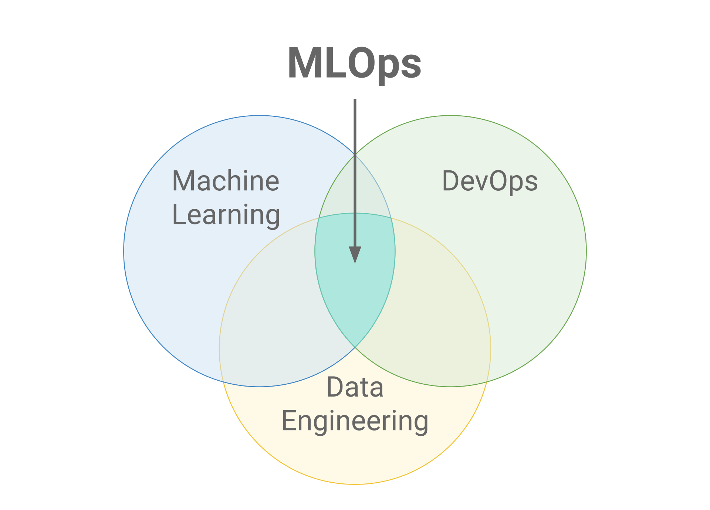
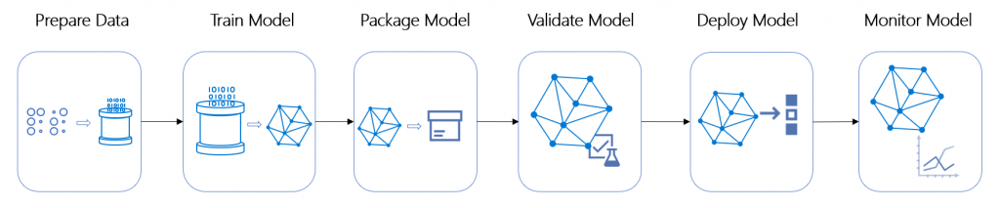

# Network Security for MLOps Solution on Azure
After being first highlighted in a paper entitled “Hidden Technical Debt in Machine Learning Systems” in 2015, Machine Learning DevOps (MLOps)'s been growing fast and its market is expected to reach $4 billion by 2025. In the meantime, how to secure the MLOps solution is becoming more and more important.

In this article, we'll talk about how to leverage Azure network security capabilities to protect MLOps solutions.
## About MLOps Security
### What is MLOps
Machine Learning DevOps (MLOps) is a set of practices at the intersection of Machine Learning, DevOps and Data Engineering, aiming to deploy and maintain machine learning models in production reliably and efficiently.  

The diagram below shows a simplified MLOps process model, which offers a solution that can automate the process of machine learning data preparation, model training, model evaluation, model registration, model deployment and model monitoring. 

### Challenges for MLOps Security
As the adoption of MLOps grows, securing MLOps solutions becomes increasingly important in the following aspects:
* Protect training data
* Protect Devops and machine learning pipelines
* Protect machine learning models
### How to Secure Your MLOps Environment
When implementing a MLOps solution on Azure, we need to consider various aspects to secure the MLOps resources in Azure:
* Authentication and Authorization
  * Use Azure service principals or managed identities instead of interactive authentication
  * Use RBAC to define the user's access scope of the resources 
* Network Security
  * Use Azure Virtual Network (VNet) to partially or fully isolate the environment from the public internet to reduce the attack surface and data exfiltration
* Data Encryption
  * Encrypt training data in transit and at rest, by using Microsoft-managed or customer-managed keys
* Policy and Monitoring
  * Use Azure Policy and the Azure Security Center to enforce policies
  * Use Azure Monitor to collect and aggregate data (metrics, logs) from variaty of sources into a common data platform where it can be used for analysis, visualization and alerting.

In this article, we'll be focusing more on how to leverage Azure Network Security mechanism to protect the MLOps environment.
## Network Security for MLOps
The diagram below shows the architecture of our sample MLOps solution, whic is based on the following Azure services:
* Data storage: Azure Blob Storage
* Model training/validation/registration: Azure Machine Learning workspace
* Model deployment: Azure Kubernetes Service
* Model monitor: Azure Monitor/Application Insights

As you can see, as the core of MLOps solution, Azure Machine Learning workspace and its associated resources are protected by the virtual network, AML VNET. 
The jump host, Azure Bastion and self-hosted agents are in another virutual network, BASTION VNET which simulates other solutions that need to access the resources within AML VNET. 
With the support of VNet peering and private DNS zones, Azure Pipelines can be executed on self-host agents and then trigger Azure Machine Learning pipelines to train/evaluate/register the machine learning models.
Finally, the model can be deployed on Azure Kubernetes Cluster.
This is how the pipelines (including Azure Pipelines and Azure Machine Learning pipelines) work in this MLOps solution.
### Secure Azure Machine Learning Workspace and Its Associated Resources
As the core components of a MLOps solution, the Azure Machine Learning Workspace is the top-level resource for Azure Machine Learning, providing a centralized place to work with all the artifacts you create when you use Azure Machine Learning.

When you create a new workspace, it automatically creates several Azure resources that are used by the workspace: 
* Azure Application Insights
* Azure Container Registry
* Azure Key Vault
* Azure Storage Account

Therefore, the first step of securing the MLOps environment, is to protect Azure Machine Learning workspace and its associated resources. The most effective way of achieving this is to use Azure Virtual Networks.

#### Azure Virtual Network
Azure Virtual Network (VNet) is the fundamental building block for your private network in Azure. VNet enables many types of Azure resources, such as Azure Virtual Machines (VM), to securely communicate with each other, the internet, and on-premises networks. 

By putting Azure Machine Learning workspace and its associated resources into a VNet, we can ensure that each components are able to communicate with each other without exposing them in the public internet. In this way, we can significantly reduce our MLOps solutions' attack surface and data exfiltration.
#### Azure Private Link and Azure Private Endpoint
Azure Private Link enables you to access Azure PaaS Services (for example, Azure Machine Learning Workspace and Azure Storage) and Azure hosted customer-owned/partner services over a private endpoint in your virtual network. The private endpoint is a network interface which only tied to the specific chosen Azure resources thereby protecting data exfiltration. 

In Figure 3, there are four private endpoints tied to the correspoinding Azure PaaS services (Azure Machine Learning workspace, Azure Blob Storage, Azure Container Registry and Azure Key Vault) that are managed by a subnet of AML VNET. Therefore, these Azure PaaS services are only accessbile to the resources within the same virtual network, i.e. AML VNET. 
#### Private Azure DNS Zone
In the sample solution of article, the private endpoints are used for other Azure services that the machine learning workspace relies on, such as Azure Storage, Azure Key Vault, or Azure Container Registry. For this reason, you must correctly configure your DNS settings to resolve the private endpoint IP address to the fully qualified domain name (FQDN) of the connection string. 

You can use private DNS zones to override the DNS resolution for a private endpoint. A private DNS zone can be linked to your virtual network to resolve specific domains.

Azure Private DNS provides a reliable, secure DNS service to manage and resolve domain names in a virtual network without the need to add a custom DNS solution. By using private DNS zones, you can use your own custom domain names rather than the Azure-provided names available today. Please note that the DNS resolution against a private DNS zone works only from virtual networks that are linked to it.

In the sample solution, we have used the following [recommended zone names for Azure services](https://docs.microsoft.com/en-us/azure/private-link/private-endpoint-dns#azure-services-dns-zone-configuration):
* privatelink.azurecr.io
* privatelink.azurewebsites.net
* privatelink.vaultcore.azure.net
* privatelink.blob.core.windows.net
* privatelink.file.core.windows.net
* privatelink.api.azureml.ms
* privatelink.notebooks.azure.net

#### Azure Virtual Network Peering
In Figure 3, in order to enable the jump host VM or self-hosted agent VMs ( in BASTION VNET)'s access to the resources in AML VNET, we use virtual network peering to seamlessly connect these two virtual networks. Thus the two virtual networks appear as one for connectivity purposes. The traffic between VMs and Azure Machine Learning resources in peered virtual networks uses the Microsoft backbone infrastructure. Like traffic between them in the same network, traffic is routed through Microsoft's private network only.

### Access Resources in the VNet
To connect to a resource that's secured behind a VNet, you can use one of the following methods:

* Azure VPN gateway - Connects on-premises networks to the VNet over a private connection. Connection is made over the public internet. There are two types of VPN gateways that you might use:
  * Point-to-site: Each client computer uses a VPN client to connect to the VNet.
  * Site-to-site: A VPN device connects the VNet to your on-premises network.
* ExpressRoute - Connects on-premises networks into the cloud over a private connection. Connection is made using a connectivity provider.
* Azure Bastion - In this scenario, you create an Azure Virtual Machine (the jump host) inside the VNet. You then connect to the VM using Azure Bastion. Bastion allows you to connect to the VM using either an RDP or SSH session from your local web browser. You then use the jump host as your development environment. Since it is inside the VNet, it can directly access the workspace.

As Azure Bastion doesn't work for Microsoft accounts. Azure VPN Gateway or ExpressRoute are recommended ways to access the resouces secured behind a VNet.
### Azure Pipeline
Azure Pipelines automatically builds and tests code projects to make them available to others. Azure Pipelines combines continuous integration (CI) and continuous delivery (CD) to test and build your code and ship it to any target.

As metioned in the previous section, the MLOps solution consists of a couple of Azure Pipelines which can trigger Azure Machine Learning pipelines and access associated resources. Since the Azure Machine Learning workspace and its associated resource are behind a VNet, we to figure out a way for a Azure Pipeline Agent(the computing infrastructure with installed agent software that runs one job of the Azure Pipeline at a time) to access them. There are a couple of ways to implement it:
* Use self-hosted agents in the same VNet or the peering VNet
* Use Microsoft-hosted agents and its IP range whitelist in the Firewall settings of target Azure services
* Use Microsoft-hosted agents (as VPN clients) and Azure VPN Gateway

#### Use Azure Container Registry in VNet
Azure Container Registry is a required service when you use Azure Machine Learing workspace to train and deploy the models.

While securing the Azure Machine Learning workspace with virtual networks, there are some prerequisites about Azure Container Registry:
* Your Azure Container Registry must be Premium version.
* Your Azure Container Registry must be in the same virtual network and subnet as the storage account and compute targets used for training or inference.
* Your Azure Machine Learning workspace must contain an Azure Machine Learning compute cluster.

In the sample solution, to ensure the self-hosted agent can access the Azure Container Registry in the VNet, you need to use VNet peering, and add virtual network link to link the private DNS zone (privatelink.azurecr.io) to BASTION VNET.

In the meantime, you should ensure that the Azure Container Registry has a contributor role for the system assigned managed identity of Azure Machine Learning workspace.

#### Use Compute Cluster/Instance in VNet
When putting Azure Machine Learning compute clusters/instances into a VNet, you need to create network security group (NSG) for the relavent subnet. This NSG contains the following rules, which are specific to compute clusters and compute instances:
* Allow inbound TCP traffic on ports 29876-29877 from the BatchNodeManagement service tag.
* Allow inbound TCP traffic on port 44224 from the AzureMachineLearning service tag.

Please also note that for compute cluster or instance, it is now possible to remove the public IP address (a preview feature). This provides better protection of your resources in the MLOps environment.
## Summary
Focusing on 'Network Security for MLOps', the article introduces the Azure services and technologies including Azure Virtual Network, Azure Private Link, VNet Peering and then illustrates how to access the resources protected by the VNet. The article also covers the topics of using Azure Pipeline, Azure Container Registry and compute cluster/instances in the MLOps solution.

## References
* [MLOps](https://en.wikipedia.org/wiki/MLOps)
* [Machine learning operations (MLOps) framework to upscale machine learning lifecycle with Azure Machine Learning](https://docs.microsoft.com/en-us/azure/architecture/example-scenario/mlops/mlops-technical-paper)
* [Secure an Azure Machine Learning workspace with virtual networks](https://docs.microsoft.com/en-us/azure/machine-learning/how-to-secure-workspace-vnet?tabs=pe)
