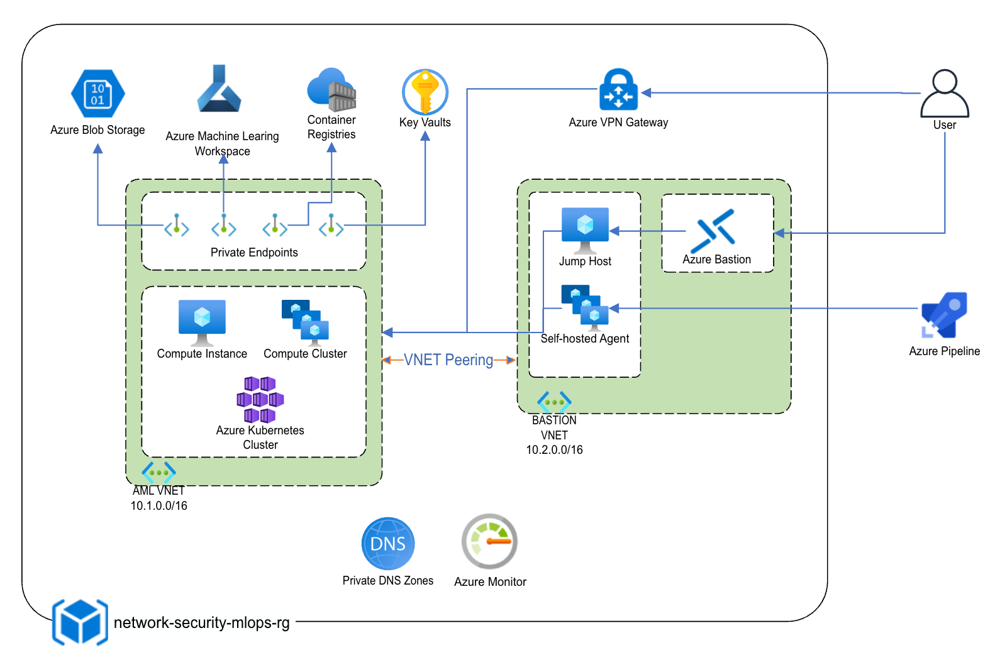

# Network security for MLOps on Azure
## About MLOps Security
### What is MLOps
Machine Learning DevOps (MLOps) is a set of practices at the intersection of Machine Learning, DevOps and Data Engineering, aiming to deploy and maintain machine learning models in production reliably and efficiently.  

Logically, MLOps offers a solution that can automate the process of machine learning data validation, model training, model evaluation, model registration and deployment as web services or on edge devices.

### Challenges for MLOps Security
After being highlighted in a paper entitled “Hidden Technical Debt in Machine Learning Systems.” in 2015, MLOps adoption's been growing fast and its market is expected to reach $4 billion by 2025. Meanwhile, securing MLOps environments has become more and more challenging in the following aspects:
* Protect training data
* Protect Devops and machine learning pipelines
* Protect machine learning models
### How to Secure Your MLOps Environment
We need to consider various aspects to secure the MLOps resources in Azure:
* Authentication and Authorization
  * Use service principals or managed identities instead of interactive authentication
  * Use RBAC to define the user's access scope of the resources 
* Network Security
  * Use VNet to partially or fully isolate the environment from the public internet to reduce the attack surface and data exfiltration
* Data Encryption
  * Encrypt training data in transit and at rest, by using Microsoft-managed or customer-managed keys
* Policy and Monitoring
  * Use Azure Policy and the Azure Security Center to enforce policies
  * Use Azure Monitor to collect and aggregate data (metrics, logs) from variaty of sources into a common data platform where it can be used for analysis, visualization and alerting.

In this article, we'll be focusing more on how to leverage Azure Network Security mechanism to protect the MLOps environment.
## Network Security for MLOps
The diagram below shows the architecture of our sample MLOps solution. 

As you can see, as the core of MLOps solution, Azure Machine Learning workspace and its associated resources have been protected by the virtual network, AML VNET. 
The jump host, Azure Bastion and self-hosted agents are in another virutual network, BASTION VNET to simulate the ways to access the resources in AML VNET. 
VNet peering and private DNS zones can ensure that jump host and self-host agents are able to access the resources in AML VNET.
### Secure Azure Machine Learning Workspace and Its Associated Resources
One of the core components of a MLOps solution is Azure Machine Learning Workspace, which is the top-level resource for Azure Machine Learning, providing a centralized place to work with all the artifacts you create when you use Azure Machine Learning.

When you create a new workspace, it automatically creates several Azure resources that are used by the workspace: 
* Azure Application Insights
* Azure Container Registry
* Azure Key Vault
* Azure Storage Account

Therefore, the first step of securing the MLOps environment, is to secure Azure Machine Learning workspace and its associated resources.

#### Azure Virtual Network
Azure Virtual Network (VNet) is the fundamental building block for your private network in Azure. VNet enables many types of Azure resources, such as Azure Virtual Machines (VM), to securely communicate with each other, the internet, and on-premises networks. 

By putting Azure Machine Learning workspace and its associated resources into a VNet, we can ensure that each components are able to communicate with each other without exposing them in the public internet. In this way, we can significantly reduce our solutions's attack surface and data exfiltration.
#### Azure Private Link and Azure Private Endpoint
Azure Private Link enables you to access Azure PaaS Services (for example, Azure Storage and SQL Database) and Azure hosted customer-owned/partner services over a private endpoint in your virtual network.

In Figure 2, there are 4 private endpoints of the Azure PaaS services (Azure Machine Learning workspace, Azure Blob Storage, Azure Container Registry and Azure Key Vault) that are managed by a subnet of AML VNET. Therefore, these Azure PaaS services are accessbile to the resources within the same virtual network, AML VNET. A private endpoint is only tied to specific chosen Azure resources thereby protecting data exfiltration. 
#### Private Azure DNS Zone
In this solution, the private endpoints are used for other Azure services that the machine learning workspace relies on, such as Azure Storage, Azure Key Vault, or Azure Container Registry. For this reason, you must correctly configure your DNS settings to resolve the private endpoint IP address to the fully qualified domain name (FQDN) of the connection string. 

You can use private DNS zones to override the DNS resolution for a private endpoint. A private DNS zone can be linked to your virtual network to resolve specific domains.

Azure Private DNS provides a reliable, secure DNS service to manage and resolve domain names in a virtual network without the need to add a custom DNS solution. By using private DNS zones, you can use your own custom domain names rather than the Azure-provided names available today. Please note that the DNS resolution against a private DNS zone works only from virtual networks that are linked to it.

List of private DNS zones:
* privatelink.azurecr.io
* privatelink.azurewebsites.net
* privatelink.vaultcore.azure.net
* privatelink.blob.core.windows.net
* privatelink.file.core.windows.net
* privatelink.api.azureml.ms
* privatelink.notebooks.azure.net

#### Azure Virtual Network Peering
In Figure 2, in order to make sure that the jump host VM or self-hosted agent VMs ( in BASTION VNET) are able to access the resources in AML VNET, we use virtual network peering to seamlessly connect the two virtual networks. Thus these two virtual networks appear as one for connectivity purposes. The traffic between VMs and Azure Machine Learning resources in peered virtual networks uses the Microsoft backbone infrastructure. Like traffic between them in the same network, traffic is routed through Microsoft's private network only.

### Access Resources in the VNet
To connect to a workspace that's secured behind a VNet, use one of the following methods:

* Azure VPN gateway - Connects on-premises networks to the VNet over a private connection. Connection is made over the public internet. There are two types of VPN gateways that you might use:
  * Point-to-site: Each client computer uses a VPN client to connect to the VNet.
  * Site-to-site: A VPN device connects the VNet to your on-premises network.
* ExpressRoute - Connects on-premises networks into the cloud over a private connection. Connection is made using a connectivity provider.
* Azure Bastion - In this scenario, you create an Azure Virtual Machine (sometimes called a jump box) inside the VNet. You then connect to the VM using Azure Bastion. Bastion allows you to connect to the VM using either an RDP or SSH session from your local web browser. You then use the jump box as your development environment. Since it is inside the VNet, it can directly access the workspace. 
### Azure Pipeline
#### Deep Dive for Azure Container Registry
While securing the Azure Machine Learning workspace with virtual networks, there are some prerequisites about Azure Container Registry:
* Your Azure Container Registry must be Premium version.
* Your Azure Container Registry must be in the same virtual network and subnet as the storage account and compute targets used for training or inference.
* Your Azure Machine Learning workspace must contain an Azure Machine Learning compute cluster.

In a MLOps pipeline, if we have VNet peering, we need add virtual network link to link the private DNS zone to the virtual network.

In the meantime, make sure that the Azure Container Registry has a contributor role for the system assigned managed identity of Azure Machine Learning workspace.

#### Deep Dive for Compute Cluster/Instance
When putting Azure Machine Learning compute clusters/instances into a VNet, you need to create network security group (NSG) for the relavent subnet. This NSG contains the following rules, which are specific to compute clusters and compute instances:
* Allow inbound TCP traffic on ports 29876-29877 from the BatchNodeManagement service tag.
* Allow inbound TCP traffic on port 44224 from the AzureMachineLearning service tag.

Please also note that for compute cluster or instance, it is now possible to remove the public IP address (a preview feature). This provides better protection of your resources in the VNet.
## References
* [MLOps](https://en.wikipedia.org/wiki/MLOps)
* [Machine learning operations (MLOps) framework to upscale machine learning lifecycle with Azure Machine Learning](https://docs.microsoft.com/en-us/azure/architecture/example-scenario/mlops/mlops-technical-paper)
* [Secure an Azure Machine Learning workspace with virtual networks](https://docs.microsoft.com/en-us/azure/machine-learning/how-to-secure-workspace-vnet?tabs=pe)
